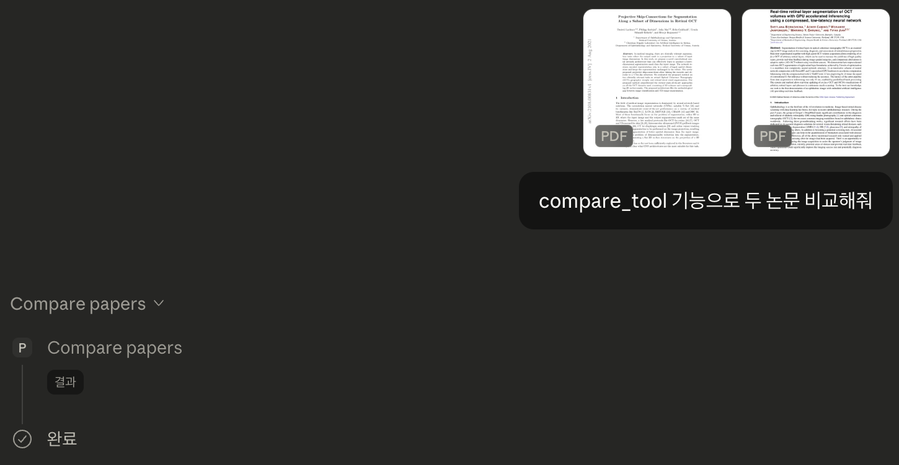

# Scholar MCP

A lightweight MCP server for AI-assisted academic paper analysis.

---

## Motivation

Automates early-stage literature review by connecting PDF parsing with Claude via MCP.

Supports:

- PDF ingestion
- Abstract extraction
- Multi-paper comparison

## Features

* **read_pdf** — Extract full text from a PDF file
* **extract_abstract** — Extract the abstract section
* **compare_papers** — Extract and prepare multiple papers for comparison
* **ping** — Test connectivity
* **update_analysis_policy (with dry-run)** — Demonstrates safe state mutation with optional simulation mode

## Architecture

Claude Desktop communicates with Scholar MCP via JSON-RPC over stdio (MCP protocol).  
The server registers tools and handles execution through structured request handlers.

The design separates:

- Read-only tools (PDF extraction & comparison)
- State-changing tools (policy updates with optional dry-run)

All tool executions are wrapped in safe error handling to prevent server disconnections.

## Installation

```bash
git clone https://github.com/mkjun2016/scholar-mcp.git
cd scholar-mcp
npm install
```

## Usage

Run locally:

```bash
node server.js
```

Configure in Claude Desktop:

```json
{
  "mcpServers": {
    "scholar-mcp": {
      "command": "/absolute/path/to/node",
      "args": ["/absolute/path/to/scholar-mcp/server.js"]
    }
  }
}
```

## Example Workflow

1. Call `compare_papers` with two PDF paths
2. Ask Claude to:

   * Compare research problems
   * Summarize methodological differences
   * Identify key contributions
   * Highlight research gaps

This enables rapid AI-assisted literature comparison.

## Technical Notes

Built on JSON-RPC over stdio (MCP) with robust error handling to ensure reliable tool execution.

## Demo

Example interaction using `compare_papers` with Claude Desktop:



## License

ISC